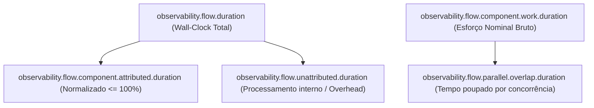

# Observability Spring Boot Starter

[](https://openjdk.org/)
[](https://spring.io/projects/spring-boot)
[](https://micrometer.io/)
[](docs/ARCHITECTURE.md)
[](LICENSE)

Starter corporativo padronizado para observabilidade unificada em ecossistemas Spring Boot 3.x, desenvolvido sob a especificação técnica **Candidate Architecture v2**: **instrumentação automática por padrão** para toda infraestrutura técnica e **instrumentação declarativa** exclusivamente onde o framework não consegue inferir a semântica de negócio.

---

## 📚 Documentação Especializada

| Documento | Descrição |
|---|---|
| 🎓 **[Tutorial Completo de Adoção](docs/TUTORIAL.md)** | Tutorial passo a passo cobrindo o como e o porquê de cada feature, com exemplos de código, o que é gerado na telemetria, boas práticas e construção de microsserviço de ponta a ponta. |
| 🏛️ **[Arquitetura do Starter](docs/ARCHITECTURE.md)** | Princípios de design, estrutura multi-módulo (`core`, `autoconfigure`, `starter`), auto-discovery condicional, diagramas de sequência de propagação de contexto assíncrono e formulação matemática da atribuição de latência. |
| ⚙️ **[Referência de Configuração](docs/CONFIGURATION_REFERENCE.md)** | Catálogo completo de propriedades `observability.*`, chaves mestras e granulares (`observability.<feature>.enabled`), parametrização de SLAs, limiares de alarmística e exemplo de `application.yml`. |
| 💡 **[Guia de Capacidades e Uso Prático](docs/CAPABILITIES_GUIDE.md)** | Guia de uso das anotações `@TrackFlow`, `@TrackStep`, `@LogLeg`, `@MaskField`, `@MDC`, `@ObservationTag`, propagação de contexto assíncrono, barramento de eventos de alerta (`AlertDispatcher`) e segregação dimensional de feature flags. |
| 📊 **[Esquema de Telemetria (Telemetry Schema)](docs/TELEMETRY_SCHEMA.md)** | Catálogo canônico de métricas dimensionais (`observability.flow.*`, `resilience4j.*`, `hikaricp.*`), chaves padronizadas de MDC (`correlation_id`, `traceId`, `variant`), esquemas de logs estruturados (`AUDIT_LEG_LOGGER`) e eventos de alerta. |

---

## 🎯 Filosofia e Princípios

Nenhuma aplicação de microsserviço de negócio deve precisar implementar:
- Instanciação de `MeterRegistry`, `Tracer`, `Timer.Sample` ou `ObservationRegistry`.
- Manipulação manual de `Span`, abertura de escopos ou chamadas de `MDC.put` / `MDC.remove`.
- Filtros manuais de extração e injeção de `X-Correlation-Id` ou W3C `traceparent`.
- Binders customizados de monitoramento de filas, bancos de dados ou disjuntores.

### O Princípio 80/20 de Observabilidade
```text
80-95% da observabilidade
          ↓
     Automática (HTTP, OpenFeign, Kafka, SQS, JDBC, HikariCP, Redis, Resilience4j, JVM, Logs)

5-20% da observabilidade
          ↓
   Semântica Declarativa (@TrackFlow, @TrackStep, @LogLeg, @MDC, @ObservationTag)
```

---

## 🏗️ Estrutura Multi-Módulo Corporativa

```text
observability-spring-boot-starter-project/
├── pom.xml                                          # Parent POM (BOM & dependências unificadas)
│
├── observability-api/                               # Contratos puros, anotações (@TrackFlow, @TrackStep, @FlowDimension, @LogLeg)
├── observability-core/                              # Domínio de observabilidade (FlowSemanticContext, CardinalityPolicy, OpenTelemetry API pura)
├── observability-autoconfigure/                     # Auto-configurações Spring Boot 3, EnvironmentPostProcessor, TracingRuntimeDetector
├── observability-spring-boot-starter/               # Starter agregador corporativo plug-and-play
├── observability-test/                              # Test Harness e Matriz de Conformidade (Single Producer, detecção de conflitos)
└── observability-legacy-compat/                     # Módulo ponte de compatibilidade para transição de legados
```

---

## 🚀 Como Usar na Aplicação

### 1. Dependência Maven

Basta adicionar a dependência agregadora no `pom.xml` da aplicação:

```xml
<dependency>
    <groupId>com.empresa.platform</groupId>
    <artifactId>observability-spring-boot-starter</artifactId>
    <version>1.0.0-SNAPSHOT</version>
</dependency>
```

### 2. Configuração Básica (`application.yml`)

```yaml
observability:
  enabled: true
  profile: datadog
  engine: datadog
  alerting:
    enabled: true
    webhook-url: "http://alert-manager.internal/webhook"
    default-flow-sla-ms: 2000
    default-step-sla-ms: 800
    flow-sla-ms:
      UserRegistration: 1000
    step-sla-ms:
      step-validate-user: 300
    hikari-pending-threshold: 2
```

---

## 📊 Matriz de Cobertura de Capacidades

| Componente | Nível | O que é coletado automaticamente |
|---|---|---|
| **Spring MVC REST** | Automática | Requisições HTTP, status, latência percentil (P95/P99), Correlation ID, propagação W3C TraceContext. |
| **OpenFeign** | Automática | Latência externa, injeção transparente de headers de correlação (`X-Correlation-Id`, `traceparent`). |
| **JDBC / Hibernate** | Automática | Spans de execução SQL e tempo transacional. |
| **HikariCP** | Automática | Métricas de conexões ativas, idle e sentinela de esgotamento (`DATABASE_POOL_STARVATION`). |
| **Kafka (Producer/Consumer)** | Automática | Métricas de envio e consumo, injeção de correlation ID nos records. |
| **AWS SQS** | Automática | Interceptor de mensagens, métricas de envio e correlação. |
| **Resilience4j** | Automática | Monitoramento de transições de estado do Circuit Breaker (`OPEN`, `HALF_OPEN`) com alertas imediatos. |
| **Subprocessos de Negócio** | Declarativa (`@TrackStep`) | Latência de esforço nominal vs atribuída no tempo de relógio, classificação arquitetural tipada via `ComponentType`. |
| **Fluxos Semânticos** | Declarativa (`@TrackFlow`) | Delimitação de orquestrações de negócio ponta a ponta e governança de interrupções. |
| **Auditoria Forense & LGPD** | Declarativa (`@LogLeg`) | Per-leg logging com mascaramento automático de dados sensíveis via SpEL (`@MaskField`). |
| **Contexto de Logs (MDC)** | Declarativa ([`@MDC`](docs/CAPABILITIES_GUIDE.md#41-mdc-eliminando-100-dos-mdcput-manuais)) | Injeção declarativa no SLF4J MDC via parâmetros ou SpEL, eliminando 100% dos `MDC.put` manuais. |
| **Tags Dinâmicas (Métricas & Spans)** | Declarativa ([`@ObservationTag`](docs/CAPABILITIES_GUIDE.md#42-observationtag-tags-em-métricas-e-spans-de-tracing)) | Extração dinâmica de dimensões semânticas para o Micrometer Observation com separação de cardinalidade. |

---

## 🧮 Motor de Atribuição de Latência (`LatencyAttributionEngine`)

Para resolver distorções matemáticas em fluxos que disparam subprocessos paralelos (`CompletableFuture.allOf`), o starter implementa o modelo de 3 métricas canônicas:



- **Invariante Matemática do Wall-Clock**:
  $$\sum \text{attributed\_duration} + \text{unattributed\_duration} = \text{wall\_clock\_duration}$$
- Em fluxos com subprocessos concorrentes, a soma simples dos tempos nominais ultrapassa o tempo de relógio. O motor calcula a sobreposição paralela (`parallel.overlap.duration`) e normaliza a contribuição atribuída de cada componente.

---

## 🛡️ Desativação Limpa (Master Switch & Toggles)

O starter pode ser totalmente desativado ou desabilitado seletivamente sem que nenhuma linha de código da aplicação sofra alteração:

```yaml
# Desliga 100% dos aspectos, filtros e watchers:
observability:
  enabled: false
```

Ou com controle granular por funcionalidade:

```yaml
observability:
  enabled: true
  feign:
    enabled: false      # Desabilita apenas interceptor Feign
  leg-logging:
    enabled: false      # Desabilita apenas auditoria @LogLeg
  alerting:
    enabled: false      # Desabilita apenas despacho de alarmística
```

---

## 🧪 Suporte a Testes & Ambientes Locais

Para suíte de testes de integração (`@SpringBootTest`), o starter respeita a injeção condicional de mocks e desabilitações seletivas, garantindo tempo de boot ultrarrápido sem dependência de coletores externos.

---

## 📄 Licença

Distribuído sob a licença [Apache 2.0](LICENSE).
