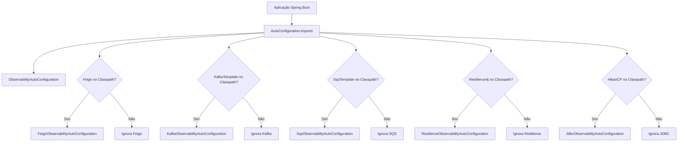
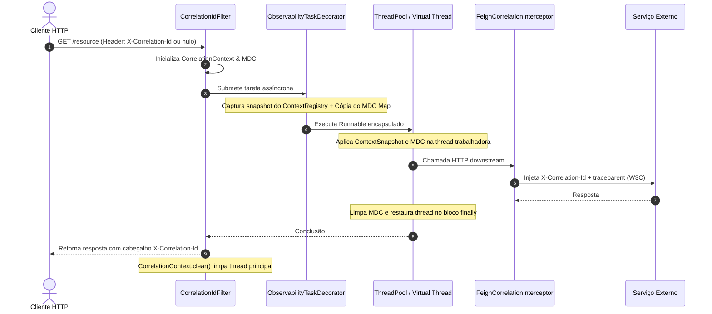
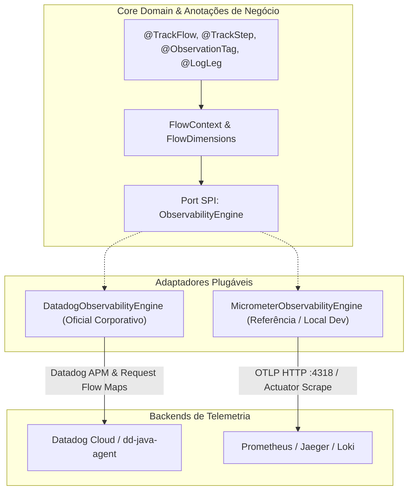

# Arquitetura do Observability Spring Boot Starter

Este documento detalha o desenho técnico, os padrões de engenharia de software e as decisões arquiteturais adotadas no **Observability Spring Boot Starter**, em estrita conformidade com a especificação técnica corporativa **Candidate Architecture v2**.

---

## 1. Princípios Arquiteturais

1. **80-95% Automático / 5-20% Declarativo**:
   - Toda a infraestrutura técnica (HTTP, RestClient, Feign, JDBC, HikariCP, Kafka, SQS, Resilience4j, JVM, Logs Estruturados, Context Propagation) é descoberta e instrumentada automaticamente.
   - Anotações são reservadas estritamente para enriquecimento semântico de negócio onde o framework não possui capacidade de inferência (`@TrackFlow`, `@TrackStep`, `@LogLeg`, `@ObservationTag`).
2. **Desacoplamento e Não-Intrusividade**:
   - Nenhuma classe de negócio manipula `MeterRegistry`, `Tracer`, `Span` ou `MDC` diretamente.
   - Desligar o starter (`observability.enabled=false`) remove 100% dos aspectos e filtros sem alterar o comportamento funcional das aplicações.
3. **Imutabilidade Matemática de Latência**:
   - Processos paralelos jamais são somados linearmente. A duração percebida pelo cliente (`wall_clock`) é o teto físico do fluxo.
4. **Proteção Nativa de Dados e Governança**:
   - Logs de payload operam como *opt-in* (`includePayload = false`), garantindo conformidade com LGPD e PCI-DSS.
   - Proteção de cardinalidade contra chaves de alta cardinalidade em TSDB.

---

## 2. Estrutura Modular Multi-Módulo

Seguindo o padrão de mercado oficial do Spring Boot (Spring Framework Reference Guide):

```text
observability-spring-boot-starter-project/
├── pom.xml                                          # Parent POM (BOM & dependências unificadas)
│
├── observability-spring-boot-starter-core/          # MÓDULO CORE (POJO / Framework-agnostic)
│   ├── annotation/                                  # Anotações de negócio: @TrackFlow, @TrackStep, @LogLeg, @ObservationTag
│   ├── flow/                                        # Modelos temporais: FlowExecution, StepExecution, LatencyAttributionEngine, FlowContext
│   ├── leg/                                         # Auditoria forense: SpelMaskingService, LegContext
│   ├── correlation/                                 # Contexto distribuído: CorrelationContext (W3C TraceContext, MDC)
│   └── alerting/                                    # Barramento de eventos: AlertDispatcher, AlertEvent, AlertNotifier
│
├── observability-spring-boot-starter-autoconfigure/ # MÓDULO AUTOCONFIGURE (Spring Boot AutoConfiguration)
│   ├── aspect/                                      # AOP: FlowTrackingAspect, SpelObservationAspect, LegLoggingAspect
│   ├── async/                                       # Propagação: ObservabilityTaskDecorator
│   ├── correlation/                                 # Filtro HTTP Servlet: CorrelationIdFilter
│   ├── feign/                                       # Interceptor Feign: FeignObservabilityAutoConfiguration
│   ├── kafka/                                       # BeanPostProcessors: KafkaObservabilityAutoConfiguration
│   ├── sqs/                                         # Auto-instrumentação: SqsObservabilityAutoConfiguration
│   ├── jdbc/                                        # Pool Watchdog: JdbcObservabilityAutoConfiguration
│   ├── resilience/                                  # Circuit Breaker: ResilienceObservabilityAutoConfiguration
│   └── resources/META-INF/spring/
│       └── org.springframework.boot.autoconfigure.AutoConfiguration.imports
│
└── observability-spring-boot-starter/               # STARTER UMBRELLA (Dependency aggregator)
    └── pom.xml                                      # Exporta core + autoconfigure + micrometer
```

---

## 3. Descoberta Automática de Topologia (Auto-Discovery)

O starter inspeciona o classpath em runtime utilizando `@ConditionalOnClass` e `@ConditionalOnWebApplication`. Se uma biblioteca não estiver presente, a autoconfiguração associada sequer é carregada:



### Regras de Ativação e Desativação Condicional
* **Master Switch**: `@ConditionalOnProperty(prefix = "observability", name = "enabled", havingValue = "true", matchIfMissing = true)` presente em todas as classes `@AutoConfiguration`.
* **Granular Switches**: Cada `@Bean` sensível possui seu próprio toggle (ex: `observability.leg-logging.enabled`, `observability.flow-tracking.enabled`).
* **Extensibilidade (`@ConditionalOnMissingBean`)**: Se a aplicação cliente prover um `@Bean` customizado (ex: um `AlertDispatcher` conectado ao PagerDuty corporativo), o starter recua e preserva a definição do desenvolvedor.

---

## 4. Motor de Atribuição de Latência (Latency Attribution Engine)

### O Problema do Paralelismo
Em arquiteturas modernas com `CompletableFuture`, chamadas paralelas (ex: enriquecimento simultâneo em 3 APIs) distorcem gráficos de latência tradicionais:
- Se uma chamada dura 100ms e dispara 3 tarefas de 80ms em paralelo, a soma linear do trabalho é $240\text{ ms}$, excedendo os $100\text{ ms}$ de tempo de relógio (*wall-clock*).
- Starters ingênuos geram frações negativas ou usam `Math.max(0, ...)` que mascaram a latência e corrompem dashboards de composição (pie charts e stacked graphs).

### Invariantes Matemáticas Canônicas
O [`LatencyAttributionEngine`](file:///Users/gleidsonfersanp/workspace/observability-spring-boot-starter-project/observability-spring-boot-starter-core/src/main/java/com/empresa/platform/observability/core/flow/LatencyAttributionEngine.java) divide a medição em **três dimensões**:
1. **Wall-Clock Duration (`observability.flow.duration`)**: Latência real percebida pelo chamador.
2. **Work Duration (`observability.flow.component.work.duration`)**: Duração bruta consumida por cada subprocesso, independente de sobreposição.
3. **Attributed Duration (`observability.flow.component.attributed.duration`)**: Latência atribuída normalizada para composição de custo.

$$\text{Se } \sum \text{work}_i \le \text{wallClock}:$$
$$\text{attributed}_i = \text{work}_i$$
$$\text{unattributed} = \text{wallClock} - \sum \text{work}_i$$

$$\text{Se } \sum \text{work}_i > \text{wallClock}:$$
$$\text{attributed}_i = \text{round}\left(\text{wallClock} \times \frac{\text{work}_i}{\sum \text{work}_k}\right)$$
$$\text{parallel\_overlap} = \sum \text{work}_i - \text{wallClock}$$

**Garantia Arquitetural**: $\sum \text{attributed}_i \approx \text{wallClock}$ em 100% dos cenários.

---

## 5. Modelo de Execução Concorrente e Propagação de Contexto

Para evitar vazamentos de memória e perdas de contexto em threads assíncronas:



* **`FlowExecution` & `StepExecution`**: Estruturados com coleções concorrentes (`ConcurrentLinkedQueue`), garantindo que dezenas de threads paralelas registrem etapas simultaneamente sem concorrência bloqueante ou *ConcurrentModificationException*.
* **`ObservabilityTaskDecorator`**: Implementa `org.springframework.core.task.TaskDecorator`, encapsulando tarefas via `ContextSnapshotFactory` e sincronizando cópia profunda do mapa MDC com restauração garantida em `finally`.

---

## 6. Arquitetura Hexagonal com Engine SPI e Datadog Oficial Corporativo

Para atender à diretriz corporativa de padronização do **Datadog** em ambientes produtivos sem gerar **Vendor Lock-in** e mantendo total autonomia de desenvolvimento local com ferramentas de código aberto (Prometheus, Jaeger, Grafana, Loki), o starter adota uma **Arquitetura Hexagonal (Ports and Adapters)**:



### Contrato da SPI (`ObservabilityEngine`)
Localizada em `com.empresa.platform.observability.core.engine`:
- `EngineCapabilities getCapabilities()`: Descoberta de recursos em tempo de execução (Service Map, Request Flow Map, DSM, in-JVM lag polling).
- `FlowScope startFlow(...)` e `void completeFlow(...)`: Gerenciamento do ciclo de vida e dimensões do fluxo.
- `StepScope startStep(...)` e `void completeStep(...)`: Medição e marcação de subprocessos.
- `void recordFlowInterruption(...)` e `void recordStepInterruption(...)`: Marcação precisa de falhas e causadores.
- `void tagAttribute(key, value)`: Enriquecimento contextual seguro.

### Capacidades dos Adaptadores
| Recurso | `DatadogObservabilityEngine` | `MicrometerObservabilityEngine` |
| :--- | :--- | :--- |
| **Padrão de Ativação** | Produção corporativa (`observability.engine=datadog`) | Local, CI e Testes (`observability.engine=micrometer`) |
| **Tags de Spans** | `flow.name`, `flow.variant`, `flow.step`, `flow.status`, `feature.name` | `flow`, `step`, `variant`, `feature` |
| **Request Flow Map** | Suportado nativamente no Trace Explorer | Via queries PromQL no Grafana |
| **Data Streams (DSM)** | Ativo via Datadog Agent (`requiresInJvmLagPolling() == false`) | Requer Binders in-JVM (`requiresInJvmLagPolling() == true`) |
| **Ponte de Rastreio** | OpenTelemetry API Bridge (`DD_TRACE_OTEL_ENABLED=true`) | Micrometer Observation API |
| **Zero Vendor Jars** | Sim (opera via padrões abertos e JVM agent) | Sim (open-source standard) |

