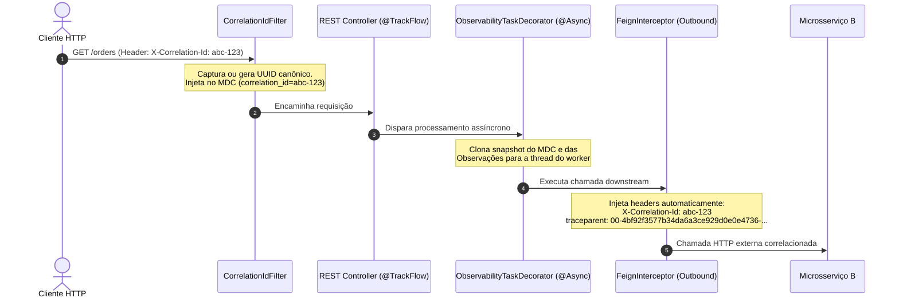

# Tutorial Completo: Observability Spring Boot Starter

> **Guia definitivo de adoção, conceitos arquiteturais e boas práticas para instrumentação unificada de microsserviços Spring Boot 3.x.**

---

## 📑 Sumário

1. [Introdução e Filosofia](#1-introdução-e-filosofia)
2. [Quickstart: Em Operação em 5 Minutos](#2-quickstart-em-operação-em-5-minutos)
3. [Guia Aprofundado de Capacidades (O Quê, Por Quê e Como)](#3-guia-aprofundado-de-capacidades)
   - [3.1. `@TrackFlow`: Delimitação de Fluxos de Negócio e Governança de SLA](#31-trackflow-delimitação-de-fluxos-de-negócio-e-governança-de-sla)
   - [3.2. `@TrackStep` e `ComponentType`: Fatiamento de Latência e Topologia Padronizada](#32-trackstep-e-componenttype-fatiamento-de-latência-e-topologia-padronizada)
   - [3.3. `@LogLeg` e `@MaskField`: Auditoria Forense e Conformidade LGPD/PCI-DSS](#33-logleg-e-maskfield-auditoria-forense-e-conformidade-lgpdpci-dss)
   - [3.4. `@MDC` e `@MDCs`: Contexto de Logs Declarativo sem Poluição de Código](#34-mdc-e-mdcs-contexto-de-logs-declarativo-sem-poluição-de-código)
   - [3.5. `@ObservationTag` e `@ObservationTags`: Dimensões de Métricas e Spans](#35-observationtag-e-observationtags-dimensões-de-métricas-e-spans)
   - [3.6. `@FlowDimension`: Variantes de Negócio e Migrações Graduais](#36-flowdimension-variantes-de-negócio-e-migrações-graduais)
   - [3.7. Propagação Transversal de Contexto: Correlation ID, Feign e Assincronismo](#37-propagação-transversal-de-contexto-correlation-id-feign-e-assincronismo)
   - [3.8. Centralização Corporativa de Logging: Logback Multi-Perfil](#38-centralização-corporativa-de-logging-logback-multi-perfil)
   - [3.9. Barramento de Alertas em Tempo Real: `AlertDispatcher`](#39-barramento-de-alertas-em-tempo-real-alertdispatcher)
   - [3.10. Single Producer e Neutralidade de Vendor (Datadog vs Prometheus)](#310-single-producer-e-neutralidade-de-vendor-datadog-vs-prometheus)
4. [Tutorial Prático: Construindo um Microsserviço de Ponta a Ponta](#4-tutorial-prático-construindo-um-microsserviço-de-ponta-a-ponta)
5. [Telemetria em Ação: O Que é Gerado nos Bastidores](#5-telemetria-em-ação-o-que-é-gerado-nos-bastidores)
6. [Boas Práticas e Anti-Padrões Evitados](#6-boas-práticas-e-anti-padrões-evitados)

---

## 1. Introdução e Filosofia

A observabilidade moderna em microsserviços frequentemente sofre de dois males opostos:
1. **Ausência de Observabilidade Semântica**: Agentes automáticos geram milhares de spans de frameworks (filtros servlet, interceptors, queries SQL isoladas), mas ninguém consegue responder perguntas cruciais de negócio: *"Qual foi o tempo gasto exclusivamente na validação de fraude do checkout?"* ou *"Qual porcentagem do tempo do fluxo de emissão de apólice é gasta no gateway bancário vs processamento interno?"*.
2. **Poluição Catastrófica de Código**: Tentando resolver o problema acima, desenvolvedores começam a injetar `MeterRegistry`, `Tracer`, `Timer.Sample`, `ObservationRegistry` e blocos de `try { MDC.put(...) } finally { MDC.remove(...) }` em controladores, serviços e repositórios. O código de domínio fica irreconhecível, coberto por 60% de infraestrutura de monitoramento.

### O Princípio 80/20 do Starter

Este starter corporativo foi projetado sob a especificação **Candidate Architecture v2**:

```text
┌────────────────────────────────────────────────────────────────────────┐
│ 80% a 95%: Instrumentação Automática por Padrão                       │
│ HTTP REST, OpenFeign, Kafka, AWS SQS, JDBC/HikariCP, Resilience4j, JVM │
│                                                                        │
│ Injeção transparente de Correlation ID, W3C TraceContext e MDC         │
└───────────────────────────────────┬────────────────────────────────────┘
                                    │
                                    ▼
┌────────────────────────────────────────────────────────────────────────┐
│ 5% a 20%: Semântica Declarativa de Negócio                            │
│ @TrackFlow, @TrackStep, @LogLeg, @MaskField, @MDC, @ObservationTag     │
│                                                                        │
│ Sem tocar em APIs de telemetria, sem poluição de código de negócio     │
└────────────────────────────────────────────────────────────────────────┘
```

---

## 2. Quickstart: Em Operação em 5 Minutos

### Passo 1: Adicionar a Dependência

Adicione o starter agregador no arquivo `pom.xml` da sua aplicação:

```xml
<dependency>
    <groupId>com.empresa.platform</groupId>
    <artifactId>observability-spring-boot-starter</artifactId>
    <version>1.0.0-SNAPSHOT</version>
</dependency>
```

### Passo 2: Configurar o `application.yml`

Defina o perfil de observabilidade desejado (ex: Datadog para produção corporativa, ou Prometheus para desenvolvimento local):

```yaml
observability:
  enabled: true
  profile: prometheus # ou 'datadog'
  engine: micrometer  # ou 'datadog'
  logging:
    profile: console  # 'console' (local legível) ou 'json' (produção estruturado)
  alerting:
    enabled: true
    default-flow-sla-ms: 2000
    default-step-sla-ms: 800
```

Pronto! Sua aplicação já possui:
- Extração e propagação automática de `X-Correlation-Id`.
- Propagação de W3C `traceparent` no OpenFeign.
- Métricas e sentinelas ativas para HikariCP, Kafka e Resilience4j.
- Logging centralizado e padronizado em Logback.
- Despacho automático de alertas para quebra de SLAs e disjuntores abertos.

---

## 3. Guia Aprofundado de Capacidades (O Quê, Por Quê e Como)

---

### 3.1. `@TrackFlow`: Delimitação de Fluxos de Negócio e Governança de SLA

#### O Que É?
Uma anotação de método aplicada no **ponto de entrada (entrypoint)** de um processo de negócio — tipicamente em métodos de `@RestController`, ouvintes `@KafkaListener`, ouvintes `@SqsListener` ou jobs agendados `@Scheduled`.

#### Por Que Usar?
- **O Problema Sem a Anotação**: Por padrão, frameworks de telemetria criam spans técnicos como `HTTP GET /api/v1/orders/{orderId}/checkout`. Se a mesma orquestração for disparada via fila Kafka (`OrderCheckoutConsumer`), as métricas ficam separadas e incomunicáveis. Desenvolvedores costumavam criar timers manuais (`Timer.builder(...)`), errando no descarte de timers e poluindo métodos com código de cronometragem.
- **A Solução com `@TrackFlow`**:
  1. Cria um escopo semântico canônico unificado (ex: `order-checkout`).
  2. Inicia o cronômetro mestre de relógio (*wall-clock duration*) para o fluxo.
  3. Governança automática de SLA (`slaLimitMs`): se o fluxo ultrapassar o limiar, um evento `FLOW_LATENCY_SLA_BREACH` é disparado automaticamente pelo barramento de alertas e uma métrica de violação é incrementada.
  4. Injeta a tag `flow="order-checkout"` automaticamente no MDC da thread e em todas as métricas filhas.
  5. Cria o span raiz de negócio na árvore de tracing distribuído.

#### Como Usar?

```java
package com.empresa.ecommerce.entrypoint;

import com.empresa.platform.observability.core.annotation.TrackFlow;
import org.springframework.web.bind.annotation.*;

@RestController
@RequestMapping("/api/v1/orders")
public class OrderCheckoutController {

    private final OrderCheckoutUseCase checkoutUseCase;

    public OrderCheckoutController(OrderCheckoutUseCase checkoutUseCase) {
        this.checkoutUseCase = checkoutUseCase;
    }

    @PostMapping("/{orderId}/checkout")
    @TrackFlow(
        value = "order-checkout",
        description = "Fluxo de finalização e liquidação de compra no e-commerce",
        slaLimitMs = 1500
    )
    public CheckoutResponse checkout(@PathVariable String orderId, @RequestBody CheckoutRequest request) {
        return checkoutUseCase.execute(orderId, request);
    }
}
```

#### O Que É Gerado nos Bastidores?
- **Métrica Micrometer**:
  - `observability.flow.duration` (Timer com tags `flow="order-checkout"`, `status="SUCCESS|ERROR"`).
  - `observability.flow.sla.violation` (Counter incrementado se ultrapassar 1500ms).
- **Tracing**:
  - Span raiz nomeado `flow.order-checkout` com atributos semânticos `flow.name="order-checkout"` e `flow.sla_limit_ms=1500`.
- **Logs**:
  - MDC enriquecido com `flow="order-checkout"` em todas as linhas de log executadas na thread.

---

### 3.2. `@TrackStep` e `ComponentType`: Fatiamento de Latência e Topologia Padronizada

#### O Que É?
Uma anotação de método para fatiar o processamento interno em etapas distintas, categorizando-as arquiteturalmente por meio do enum fechado [`ComponentType`](file:///Users/gleidsonfersanp/workspace/observability-spring-boot-starter-project/observability-api/src/main/java/com/empresa/platform/observability/core/annotation/ComponentType.java).

#### Por Que Usar?

##### 1. Por que `ComponentType` é um enum restrito (18 tipos) em vez de String livre?
- **O Risco da String Livre**: Quando desenvolvedores usam strings arbitrárias como `type="meu-banco-oracle-v2"` ou `type="chamada_cliente_legado"`, ocorre uma **explosão de cardinalidade** catastrófica no banco de séries temporais (Prometheus TSDB ou Datadog Metrics). Isso causa degradação de performance no servidor de métricas, elevação brutal nos custos de ingestão e faturas astronômicas em provedores SaaS.
- **O Benefício do Enum Fechado**:
  - Garante risco zero de estouro de cardinalidade.
  - Permite a criação de **Dashboards Corporativos Globais**: uma única query PromQL consegue exibir o tempo gasto em banco de dados (`type="DATABASE"`) ou integrações HTTP (`type="HTTP"` / `type="FEIGN"`) para **todos** os microsserviços da empresa simultaneamente.
  - Alimenta automaticamente mapas de topologia e Request Flow Maps (ex: Datadog Service Map e APM).

##### 2. Esforço Nominal (*Work Duration*) vs Duração de Relógio Atribuída (*Attributed Duration*)
Em métodos que executam integrações concorrentes (ex: `CompletableFuture.allOf` disparando 3 chamadas HTTP em paralelo):
- Chamada A: 200ms
- Chamada B: 200ms
- Chamada C: 200ms
- **Soma Simples (Esforço Nominal)**: 600ms.
- **Tempo Real de Relógio (Wall-Clock Total)**: Apenas 210ms!

Se a ferramenta de métricas somar ingenuamente os tempos, o gráfico de pizza ultrapassa 100% da duração real. O motor [`LatencyAttributionEngine`](file:///Users/gleidsonfersanp/workspace/observability-spring-boot-starter-project/observability-core/src/main/java/com/empresa/platform/observability/core/attribution/LatencyAttributionEngine.java) do starter resolve isso:
- Calcula o esforço nominal bruto em `observability.flow.component.work.duration`.
- Calcula a fatia fracionária normalizada atribuída ao relógio em `observability.flow.component.attributed.duration`.
- Calcula a sobreposição paralela economizada em `observability.flow.parallel.overlap.duration`.
- Isola o overhead de processamento interno em `observability.flow.unattributed.duration`.

#### Como Usar?

```java
package com.empresa.ecommerce.integration;

import com.empresa.platform.observability.core.annotation.ComponentType;
import com.empresa.platform.observability.core.annotation.TrackStep;
import org.springframework.stereotype.Component;

@Component
public class PaymentGatewayIntegration {

    private final PaymentFeignClient feignClient;

    public PaymentGatewayIntegration(PaymentFeignClient feignClient) {
        this.feignClient = feignClient;
    }

    @TrackStep(
        value = "charge-credit-card",
        type = ComponentType.FEIGN,
        slaLimitMs = 800,
        critical = true
    )
    public PaymentReceipt executeCharge(ChargeCommand command) {
        return feignClient.authorizePayment(command);
    }
}
```

```java
@Repository
public class OrderRepositoryImpl implements OrderRepository {

    @TrackStep(value = "save-order-record", type = ComponentType.DATABASE)
    public OrderEntity save(OrderEntity entity) {
        return jpaRepository.save(entity);
    }
}
```

#### O Que É Gerado nos Bastidores?
- **Métricas**:
  - `observability.step.duration` com tags `flow="order-checkout"`, `step="charge-credit-card"`, `type="FEIGN"`, `critical="true"`.
  - `observability.flow.component.attributed.duration` para decomposição matemática do fluxo.
- **Tracing**:
  - Span filho conectado ao span pai do fluxo atual, contendo atributos `component.type="FEIGN"` e `step.name="charge-credit-card"`.

---

### 3.3. `@LogLeg` e `@MaskField`: Auditoria Forense e Conformidade LGPD/PCI-DSS

#### O Que É?
Um mecanismo de auditoria forense estruturada para registrar saltos de rede e integrações críticas (pernas de entrada `INBOUND` e pernas de saída `OUTBOUND`) com suporte a mascaramento dinâmico via SpEL.

#### Por Que Usar?
1. **Conformidade Legal com LGPD / GDPR e PCI-DSS**:
   Gravar dados pessoais de clientes (CPF, número de cartão de crédito, senhas, tokens) em logs em texto claro é uma violação grave de segurança e conformidade jurídica. O `@MaskField` intercepta e mascara os campos antes mesmo de qualquer string ser gerada para o logger.
2. **Por que `includePayload = false` é o padrão obrigatório?**
   Em aplicações de alta volumetria (5.000 a 50.000 TPS), serializar e registrar payloads completos de JSON em todas as requisições:
   - Causa **pressão gigantesca no Garbage Collector** da JVM (alocação massiva de objetos efêmeros na heap).
   - Esgota a largura de banda de I/O em disco e rede.
   - **Multiplica a fatura de ingestão de logs** em ferramentas SaaS (Datadog Logs, Splunk, SumoLogic) por 10x a 30x.
   - Por isso, por padrão, o `@LogLeg` registra estritamente os metadados de auditoria: duração da perna, endpoint, sistema alvo, status HTTP e código de retorno. O payload só é ativado deliberadamente onde estritamente necessário (`includePayload = true`).

#### Como Usar?

```java
package com.empresa.ecommerce.entrypoint;

import com.empresa.platform.observability.core.annotation.LogLeg;
import com.empresa.platform.observability.core.annotation.MaskField;
import com.empresa.platform.observability.core.annotation.leg.LegType;
import com.empresa.platform.observability.core.annotation.leg.MaskPattern;
import org.springframework.web.bind.annotation.*;

@RestController
@RequestMapping("/api/v1/customers")
public class CustomerRegistrationController {

    private final CustomerService customerService;

    public CustomerRegistrationController(CustomerService customerService) {
        this.customerService = customerService;
    }

    @PostMapping
    @LogLeg(
        target = "customer-ingress",
        type = LegType.INBOUND,
        includePayload = true,
        mask = {
            @MaskField(expression = "#request.cpf", pattern = MaskPattern.CPF_PARTIAL),
            @MaskField(expression = "#request.cardNumber", pattern = MaskPattern.CARD_PARTIAL),
            @MaskField(expression = "#request.password", pattern = MaskPattern.PASSWORD),
            @MaskField(expression = "#result?.email()", pattern = MaskPattern.EMAIL_PARTIAL)
        }
    )
    public CustomerResponse register(@RequestBody CustomerRegistrationRequest request) {
        return customerService.register(request);
    }
}
```

#### O Que É Gerado nos Bastidores?
O logger canônico dedicado `AUDIT_LEG_LOGGER` emite um evento estruturado:
```json
{
  "timestamp": "2026-09-30T14:00:00.123Z",
  "logger": "AUDIT_LEG_LOGGER",
  "level": "INFO",
  "leg_target": "customer-ingress",
  "leg_type": "INBOUND",
  "leg_phase": "END",
  "duration_ms": 42,
  "status": "SUCCESS",
  "correlation_id": "c8a49c67-6a4a-4a2e-b615-181934981123",
  "payload": {
    "name": "Maria Silva",
    "cpf": "123.***.***-00",
    "cardNumber": "************4444",
    "password": "********"
  }
}
```

---

### 3.4. `@MDC` e `@MDCs`: Contexto de Logs Declarativo sem Poluição de Código

#### O Que É?
Anotações que injetam chaves e valores no SLF4J MDC (Mapped Diagnostic Context) de maneira puramente declarativa, interceptando a execução via AOP.

#### Por Que Usar?
- **Eliminação de 100% do Boilerplate**: Nunca mais escreva:
  ```java
  // CÓDIGO PROIBIDO / ANTI-PADRÃO:
  MDC.put("userId", userId);
  try {
      service.doWork();
  } finally {
      MDC.remove("userId");
  }
  ```
- **Segurança Absoluta contra Vazamento em Thread Pools (Stack Semantics)**:
  Em servidores com reuso de threads (Tomcat, Netty, pools de `@Async`), se uma exceção ocorrer antes de um `MDC.remove()`, a thread volta ao pool com o `userId` de um cliente e atende a requisição de **outro cliente** minutos depois, misturando logs e gerando incidentes graves de privacidade.
  O aspecto [`MdcAspect`](file:///Users/gleidsonfersanp/workspace/observability-spring-boot-starter-project/observability-core/src/main/java/com/empresa/platform/observability/core/aspect/MdcAspect.java) implementa semântica de pilha (*stack semantics*):
  - Ao entrar no método, guarda o valor prévio daquela chave (caso já existisse em um método chamador).
  - No bloco `finally`, restaura o valor anterior ou remove a chave se ela não existia.
- **Por que está separado de `@ObservationTag`?**
  MDC é destinado estritamente aos **logs textuais** da thread corrente para facilitar buscas no Loki, Elasticsearch ou Datadog Logs. Injetar dados de alta cardinalidade (como `userId`, `cartId`, `cpf`) em tags de observação de métricas explodiria o Prometheus.

#### Como Usar?

O `@MDC` suporta 3 modalidades flexíveis:

##### 1. Extração Direta de Parâmetro
Basta anotar o parâmetro do método. O valor passado como argumento é injetado no MDC:
```java
@GetMapping("/{userId}")
public UserProfile getUserProfile(@PathVariable @MDC("userId") String userId) {
    log.info("Buscando perfil do usuário"); // Log já sai com userId=...
    return userService.getProfile(userId);
}
```

##### 2. Extração Dinâmica via Expressão SpEL
Para objetos complexos recebidos no corpo da requisição:
```java
@PostMapping
@MDC(key = "userId", expression = "#request.userId")
@MDC(key = "tenantId", expression = "#request.tenantId")
public UserResponse createUser(@RequestBody CreateUserRequest request) {
    log.info("Provisionando novo usuário"); // userId e tenantId presentes!
    return userService.create(request);
}
```

##### 3. Valor Estático de Configuração
Útil para marcar a camada arquitetural, versão do fluxo ou canal:
```java
@MDC(key = "flowType", value = "orchestrated-provisioning")
@MDC(key = "channel", value = "web")
public void executeProvisioning() {
    log.info("Executando orquestração"); // flowType e channel garantidos
}
```

##### 4. Múltiplos MDCs via `@MDCs`
Você pode agrupar várias declarações com facilidade:
```java
@MDCs({
    @MDC(key = "userId", expression = "#user.id"),
    @MDC(key = "role", expression = "#user.role"),
    @MDC(key = "environment", value = "production")
})
public void updatePermissions(User user) {
    log.info("Atualizando permissões de usuário");
}
```

---

### 3.5. `@ObservationTag` e `@ObservationTags`: Dimensões de Métricas e Spans

#### O Que É?
Anotação declarativa para anexar tags semânticas ao ciclo de vida da `Observation` do Micrometer (afetando tanto métricas temporais quanto spans de tracing distribuído).

#### Por Que Usar?
Permite enriquecer métricas e spans a partir de dados de entrada (`#param`) ou resultados retornados (`#result`) sem precisar injetar APIs do Micrometer.

#### O Risco Crítico de Cardinalidade: `lowCardinality` vs `highCardinality`
- **`lowCardinality = true` (Padrão)**:
  - Destinado a dimensões finitas e previsíveis: tipo de plano (`FREE`, `PREMIUM`), região (`US_EAST`, `SA_EAST`), método de pagamento (`PIX`, `CREDIT_CARD`), status (`SUCCESS`, `ERROR`).
  - É roteado para o **TSDB (Prometheus / Datadog Metrics)**.
  - **NUNCA** coloque identificadores únicos (`userId`, `orderId`, `email`, `cpf`) com `lowCardinality = true`.
- **`lowCardinality = false`**:
  - Destinado a identificadores únicos ou de alta cardinalidade: `orderId="ord-99238"`, `transactionId="tx-18491823"`.
  - É roteado **exclusivamente para os atributos do Span de tracing** (Jaeger / OpenTelemetry / Datadog APM).
  - Não cria séries temporais no Prometheus, mantendo seu banco de métricas saudável e barato.

#### Como Usar?

```java
package com.empresa.ecommerce.service;

import com.empresa.platform.observability.core.annotation.ObservationTag;
import io.micrometer.observation.annotation.Observed;
import org.springframework.stereotype.Service;

@Service
public class SubscriptionService {

    @Observed(name = "subscription.upgrade")
    @ObservationTag(key = "customer.tier", expression = "#request.tier", lowCardinality = true)
    @ObservationTag(key = "subscription.id", expression = "#result?.id()", lowCardinality = false)
    public SubscriptionResult upgrade(UpgradeRequest request) {
        // Lógica de negócio limpa...
        return new SubscriptionResult("sub-88123", true);
    }
}
```

---

### 3.6. `@FlowDimension`: Variantes de Negócio e Migrações Graduais

#### O Que É?
Uma anotação de primeira classe para anexar dimensões de negócio macro ao escopo do `@TrackFlow`.

#### Por Que Usar?
Em migrações arquiteturais, implantações graduais (*canary deployments*) ou testes A/B de novas regras de negócio:
- Sem `@FlowDimension`, os times criavam novos métodos, duplicavam métricas ou criavam nomes de endpoints como `GET /orders/v2`.
- Com `@FlowDimension(key = "variant", value = "new-engine")`, o fluxo mantém o mesmo nome semântico (`order-checkout`), mas a métrica é fatiada dimensionalmente:
  ```promql
  # Comparando a latência do motor legado vs motor novo no mesmo gráfico:
  sum by (variant) (rate(observability_flow_duration_seconds_sum{flow="order-checkout"}[5m]))
  /
  sum by (variant) (rate(observability_flow_duration_seconds_count{flow="order-checkout"}[5m]))
  ```

#### Como Usar?

```java
@TrackFlow("order-checkout")
@FlowDimension(key = "variant", value = "async-event-driven")
@PostMapping("/checkout")
public OrderResponse checkout(@RequestBody CheckoutRequest request) {
    return orderService.process(request);
}
```

---

### 3.7. Propagação Transversal de Contexto: Correlation ID, Feign e Assincronismo

#### O Que É e Como Funciona?
Em sistemas distribuídos, uma transação inicia em uma requisição HTTP, delega tarefas para threads assíncronas em segundo plano e realiza chamadas para outros microsserviços via OpenFeign. Se o identificador de correlação se perder nesse caminho, é impossível rastrear o incidente.

O starter garante propagação transparente de ponta a ponta sem nenhuma linha de código manual:



---

### 3.8. Centralização Corporativa de Logging: Logback Multi-Perfil

#### O Que É?
O starter empacota as configurações corporativas canônicas [`logback.yml`](file:///Users/gleidsonfersanp/workspace/observability-spring-boot-starter-project/observability-autoconfigure/src/main/resources/logback.yml) e [`observability-logback-defaults.xml`](file:///Users/gleidsonfersanp/workspace/observability-spring-boot-starter-project/observability-autoconfigure/src/main/resources/com/empresa/platform/observability/logback/observability-logback-defaults.xml).

#### Por Que Usar?
- **Zero Configuração Duplicada**: Evita que cada novo microsserviço copie e cole arquivos XML de 300 linhas de Logback propensos a erros e divergências de formatação.
- **Inteligência Multi-Perfil Nativa**:
  1. **Perfil de Desenvolvimento Local (`console`)**:
     Formato legível para humanos no terminal, com cores ANSI, destacando claramente:
     `[cid=123-abc] [traceId,spanId] [flow=order-checkout,step=charge-card]`.
  2. **Perfil de Nuvem / Produção (`json`)**:
     JSON mono-linha de altíssima performance, com todos os campos do MDC indexados como atributos de primeiro nível (`correlation_id`, `trace_id`, `span_id`, `flow`, `step`, `userId`, etc.), pronto para ingestão nativa pelo Datadog Log Management, Grafana Loki ou Elasticsearch.

#### Como Configurar no `application.yml`?

```yaml
observability:
  logging:
    profile: console # ou 'json' em produção
```

Se o seu microsserviço precisar de um `logback-spring.xml` próprio (por exemplo, para configurar um appender específico de socket ou arquivo), basta importar as definições canônicas do starter:

```xml
<configuration>
    <include resource="com/empresa/platform/observability/logback/observability-logback-defaults.xml"/>
    
    <root level="INFO">
        <appender-ref ref="CONSOLE"/>
    </root>
</configuration>
```

---

### 3.9. Barramento de Alertas em Tempo Real: `AlertDispatcher`

#### O Que É?
Um barramento desacoplado para emissão e tratamento de eventos de anomalia e incidentes operacionais em tempo de execução.

#### Por Que Usar?
Em vez de acoplar sua aplicação diretamente a clientes de webhook do Slack, Teams, PagerDuty ou APIs do Datadog, o starter emite eventos desacoplados através de [`AlertDispatcher.dispatch(AlertEvent)`](file:///Users/gleidsonfersanp/workspace/observability-spring-boot-starter-project/observability-api/src/main/java/com/empresa/platform/observability/core/alerting/AlertDispatcher.java).

#### Eventos Monitorados Automaticamente pelo Starter:
| Tipo de Alerta (`AlertType`) | Severidade | Gatilho Automático |
|---|---|---|
| `CIRCUIT_BREAKER_OPEN` | `CRITICAL` | Disjuntor Resilience4j abriu por taxa excessiva de falhas ou lentidão. |
| `CIRCUIT_BREAKER_DEGRADED` | `WARNING` | Disjuntor entrou em `HALF_OPEN` tentando auto-recuperação parcial. |
| `FLOW_LATENCY_SLA_BREACH` | `WARNING` | Duração fim a fim do `@TrackFlow` violou o `slaLimitMs`. |
| `INTEGRATION_LATENCY_SLA_BREACH` | `WARNING` | Duração de um `@TrackStep` violou o SLA individual configurado. |
| `DATABASE_POOL_STARVATION` | `CRITICAL` | Pool HikariCP detectou threads bloqueadas esperando conexões. |
| `KAFKA_LAG_HIGH` | `WARNING` | Watchdog detectou acúmulo de lag no grupo de consumidores Kafka. |
| `SQS_BACKLOG_HIGH` | `WARNING` | Fila SQS acumulou profundidade de mensagens acima do limiar. |

#### Como Criar um Notificador Customizado (Ex: Notificação de Incidentes no Slack)?
Basta registrar um componente Spring implementando [`AlertNotifier`](file:///Users/gleidsonfersanp/workspace/observability-spring-boot-starter-project/observability-api/src/main/java/com/empresa/platform/observability/core/alerting/AlertNotifier.java):

```java
package com.empresa.ecommerce.alerting;

import com.empresa.platform.observability.core.alerting.AlertEvent;
import com.empresa.platform.observability.core.alerting.AlertNotifier;
import com.empresa.platform.observability.core.alerting.AlertSeverity;
import org.springframework.stereotype.Component;

@Component
public class SlackIncidentNotifier implements AlertNotifier {

    @Override
    public void notify(AlertEvent event) {
        if (event.severity() == AlertSeverity.CRITICAL) {
            String mensagem = String.format("🚨 *INCIDENTE CRÍTICO* [%s] no serviço %s: %s (Valor: %.2f | Limiar: %.2f)",
                event.type(), event.service(), event.message(), event.currentValue(), event.threshold());
            // Envia para o Webhook do Slack...
        }
    }
}
```

---

### 3.10. Single Producer e Neutralidade de Vendor (Datadog vs Prometheus)

#### O Que É?
Uma garantia arquitetural rigorosa aplicada no momento da inicialização da JVM (*fail-fast startup validation*) através do [`ObservabilityTopologyValidator`](file:///Users/gleidsonfersanp/workspace/observability-spring-boot-starter-project/observability-autoconfigure/src/main/java/com/empresa/platform/observability/autoconfigure/topology/ObservabilityTopologyValidator.java).

#### O Princípio "Single Producer per Signal":
- **O Problema da Duplicidade de Custos**: Se uma aplicação subir ao mesmo tempo o registry do Datadog e o endpoint do Prometheus raspado por um agente, a empresa paga **duas vezes** pelo armazenamento e ingestão da mesma métrica em provedores de nuvem.
- **A Solução do Starter**:
  - Se `observability.profile: datadog` estiver ativo: exportação para o Datadog é garantida e registries duplicados são desabilitados.
  - Se `observability.profile: prometheus` estiver ativo: exportadores proprietários são desativados e o endpoint `/actuator/prometheus` assume a produção canônica.
  - A exportação simultânea só é permitida mediante autorização explícita via `observability.metrics.allow-dual-export: true` (usada exclusivamente durante janelas curtas de migração de ferramentas).

---

## 4. Tutorial Prático: Construindo um Microsserviço de Ponta a Ponta

Vamos demonstrar como um fluxo de negócio completo é construído com elegância e visibilidade total, combinando todas as anotações do starter.

### 4.1. O Controlador de Entrada (Entrypoint REST)
Aplica `@TrackFlow`, `@MDC` para enriquecer logs e `@LogLeg` para registrar a requisição recebida com mascaramento:

```java
package com.empresa.ecommerce.api;

import com.empresa.ecommerce.domain.*;
import com.empresa.platform.observability.core.annotation.*;
import com.empresa.platform.observability.core.annotation.leg.*;
import org.slf4j.Logger;
import org.slf4j.LoggerFactory;
import org.springframework.http.ResponseEntity;
import org.springframework.web.bind.annotation.*;

@RestController
@RequestMapping("/api/v1/orders")
public class OrderController {

    private static final Logger log = LoggerFactory.getLogger(OrderController.class);
    private final OrderOrchestratorService orderService;

    public OrderController(OrderOrchestratorService orderService) {
        this.orderService = orderService;
    }

    @PostMapping
    @TrackFlow(value = "order-checkout", description = "Orquestração completa de compra", slaLimitMs = 1500)
    @FlowDimension(key = "checkout_channel", value = "web-portal")
    @LogLeg(
        target = "order-ingress",
        type = LegType.INBOUND,
        includePayload = true,
        mask = {
            @MaskField(expression = "#request.cardNumber", pattern = MaskPattern.CARD_PARTIAL),
            @MaskField(expression = "#request.customerEmail", pattern = MaskPattern.EMAIL_PARTIAL)
        }
    )
    @MDC(key = "userId", expression = "#request.userId")
    @MDC(key = "tenantId", expression = "#request.tenantId")
    public ResponseEntity<OrderConfirmation> checkout(@RequestBody OrderRequest request) {
        log.info("Recebida nova ordem de compra para o usuário");
        OrderConfirmation confirmation = orderService.processOrder(request);
        return ResponseEntity.ok(confirmation);
    }
}
```

### 4.2. O Serviço de Orquestração (Domínio e Subprocessos)
Aplica `@TrackStep` para fatiar o tempo gasto no processamento de negócio, delegando as integrações:

```java
package com.empresa.ecommerce.domain;

import com.empresa.ecommerce.integration.*;
import com.empresa.platform.observability.core.annotation.*;
import org.slf4j.Logger;
import org.slf4j.LoggerFactory;
import org.springframework.stereotype.Service;

@Service
public class OrderOrchestratorService {

    private static final Logger log = LoggerFactory.getLogger(OrderOrchestratorService.class);

    private final PaymentClient paymentClient;
    private final InventoryClient inventoryClient;
    private final OrderDatabaseRepository orderRepository;

    public OrderOrchestratorService(PaymentClient paymentClient,
                                    InventoryClient inventoryClient,
                                    OrderDatabaseRepository orderRepository) {
        this.paymentClient = paymentClient;
        this.inventoryClient = inventoryClient;
        this.orderRepository = orderRepository;
    }

    public OrderConfirmation processOrder(OrderRequest request) {
        // Etapa 1: Reserva de Estoque
        inventoryClient.reserveItems(request.items());

        // Etapa 2: Cobrança Externa
        PaymentReceipt receipt = paymentClient.charge(request.userId(), request.totalAmount());

        // Etapa 3: Persistência no Banco de Dados
        return orderRepository.persistOrder(request, receipt);
    }
}
```

### 4.3. O Cliente de Integração Externa (Feign com Resiliência e Auditoria)
Aplica `@TrackStep`, `@CircuitBreaker`, `@LogLeg` e `@ObservationTag`:

```java
package com.empresa.ecommerce.integration;

import com.empresa.platform.observability.core.annotation.*;
import com.empresa.platform.observability.core.annotation.leg.LegType;
import io.github.resilience4j.circuitbreaker.annotation.CircuitBreaker;
import org.springframework.stereotype.Component;

@Component
public class PaymentClient {

    private final PaymentFeignClient feignClient;

    public PaymentClient(PaymentFeignClient feignClient) {
        this.feignClient = feignClient;
    }

    @TrackStep(value = "charge-payment-gateway", type = ComponentType.FEIGN, slaLimitMs = 800, critical = true)
    @LogLeg(target = "payment-gateway", type = LegType.OUTBOUND)
    @CircuitBreaker(name = "payment-gateway", fallbackMethod = "chargeFallback")
    @ObservationTag(key = "payment.provider", expression = "'cielo'", lowCardinality = true)
    public PaymentReceipt charge(@MDC("userId") String userId, Double amount) {
        return feignClient.authorize(new AuthorizationPayload(userId, amount));
    }

    // Fallback invocado automaticamente quando o Circuit Breaker abrir
    public PaymentReceipt chargeFallback(String userId, Double amount, Throwable t) {
        return PaymentReceipt.failed("Fallback ativado devido a indisponibilidade do gateway: " + t.getMessage());
    }
}
```

---

## 5. Telemetria em Ação: O Que é Gerado nos Bastidores

Ao executar a requisição `POST /api/v1/orders`, a telemetria é emitida de forma orquestrada e padronizada:

### 1. No Console / Logs Estruturados
```text
2026-09-30 14:15:20.102 [http-nio-8080-exec-1] INFO  c.e.e.a.OrderController [cid=4c6e91f1-3d77] [traceId=a18d9,spanId=f301b] [flow=order-checkout,step=none] - Recebida nova ordem de compra para o usuário
2026-09-30 14:15:20.145 [http-nio-8080-exec-1] INFO  AUDIT_LEG_LOGGER         [cid=4c6e91f1-3d77] [traceId=a18d9,spanId=f301b] [flow=order-checkout,step=charge-payment-gateway] - {"leg_target":"payment-gateway","leg_type":"OUTBOUND","duration_ms":120,"status":"SUCCESS"}
```

### 2. No Prometheus / Grafana (Métricas de Decomposição de Fluxo)
```promql
# 1. Duração total do fluxo de checkout
observability_flow_duration_seconds{flow="order-checkout", status="SUCCESS"}

# 2. Decomposição de fatias de latência do fluxo (Gráfico de Pizza 100%)
sum by (step) (rate(observability_step_duration_seconds_sum{flow="order-checkout"}[5m]))

# 3. Tempo por tipo de componente (DATABASE vs FEIGN vs INTERNAL)
sum by (type) (rate(observability_flow_component_attributed_duration_seconds_sum{flow="order-checkout"}[5m]))
```

### 3. No Jaeger / OpenTelemetry / Datadog APM (Árvore de Tracing)
```text
[Trace: a18d9]
└── flow.order-checkout (Duração: 185ms) [flow="order-checkout", variant="web-portal"]
    ├── step.reserve-inventory (Duração: 35ms) [type="FEIGN"]
    ├── step.charge-payment-gateway (Duração: 120ms) [type="FEIGN", payment.provider="cielo"]
    └── step.save-order-record (Duração: 18ms) [type="DATABASE"]
```

---

## 6. Boas Práticas e Anti-Padrões Evitados

| O Que Fazer (Boa Prática) ✅ | O Que Evitar (Anti-Padrão) ❌ |
|---|---|
| Usar `@TrackFlow` exclusivamente nos pontos de entrada da aplicação (Controllers HTTP, Consumers Kafka/SQS). | Anotar `@TrackFlow` em classes internas ou serviços intermediários. |
| Utilizar o enum tipado `ComponentType` no `@TrackStep` (`ComponentType.DATABASE`, `FEIGN`). | Usar strings arbitrárias ou inventar novos tipos ad-hoc, arriscando estouro de cardinalidade. |
| Usar `@MDC` para enriquecer logs textuais com `userId`, `orderId` ou `tenantId`. | Chamar `MDC.put()` manualmente e esquecer o bloco `finally { MDC.remove() }`, vazando dados na thread. |
| Marcar identificadores únicos no `@ObservationTag` com `lowCardinality = false`. | Marcar IDs únicos (`userId`, `cpf`) com `lowCardinality = true`, gerando milhões de séries no Prometheus. |
| Manter `includePayload = false` por padrão em `@LogLeg`, ativando apenas onde estritamente necessário para auditoria. | Logar payloads completos de todas as requisições em alta volumetria, saturando o GC e estourando custos de log. |
| Configurar `observability.profile: datadog` ou `prometheus` de acordo com a infraestrutura corporativa. | Subir múltiplos exporters de métricas simultaneamente sem necessidade, pagando faturas duplicadas em SaaS. |

---

## 7. Conclusão

Com o **Observability Spring Boot Starter**, seu microsserviço atinge maturidade de observabilidade de classe mundial:
- **Zero linhas de código manual** de métricas ou timers.
- **Conformidade imediata** com padrões corporativos e leis de privacidade de dados.
- **Decomposição exata de tempo** sem distorções causadas por paralelismo.
- **Alarmística proativa** integrada aos seus disjuntores e pools de conexões.

Para mais detalhes sobre configurações avançadas, consulte a [Referência de Configuração](CONFIGURATION_REFERENCE.md) e o [Guia de Capacidades](CAPABILITIES_GUIDE.md).
